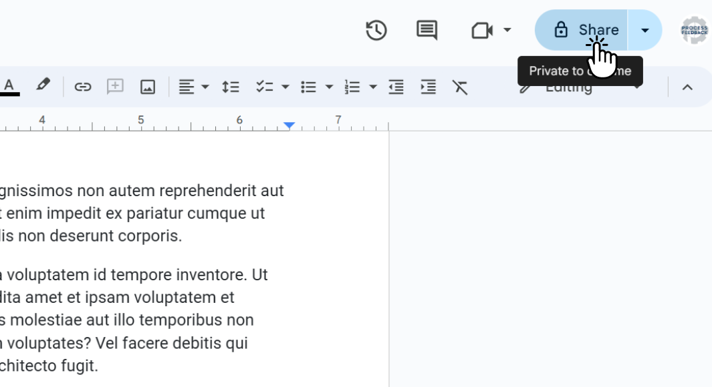
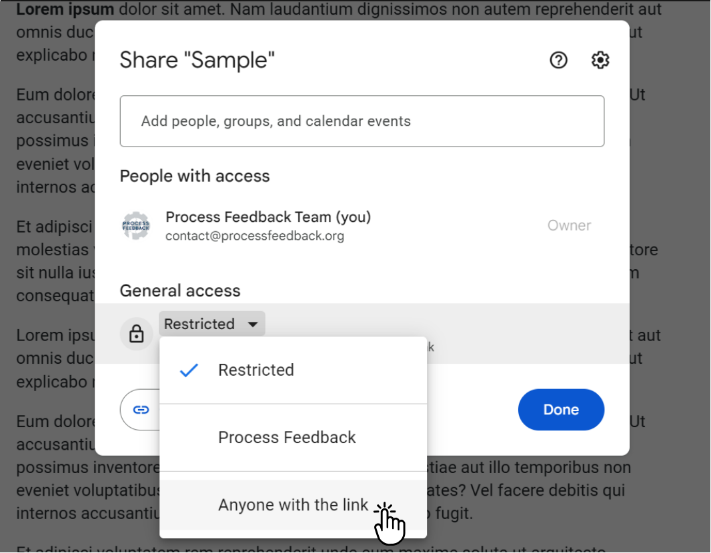
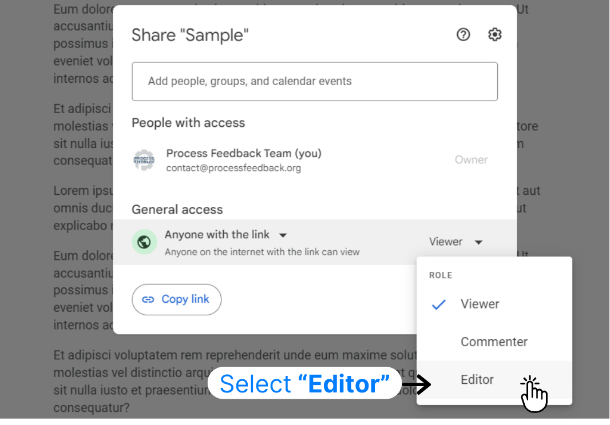
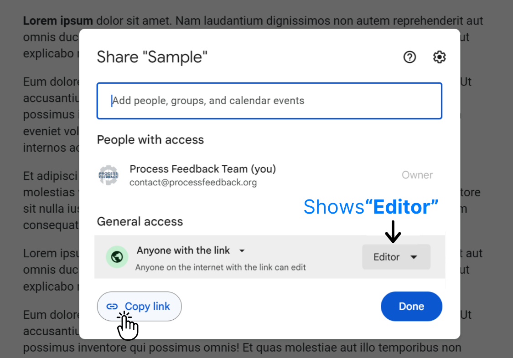

# How to share the edit link of a Google Docs document

---

If you typed in Google Docs, you can share your writing process by sharing the document’s edit link. Granting **edit access** also lets the recipient view the entire edit history, which effectively shares your writing process with your teacher.

The steps below show you how to obtain the "Edit Link" to your Google Docs document and share it with others.

### Step 1. Open the Google Docs document

Open the Google Docs document for which you would like to obtain an edit link.

### Step 2. Click on the "Share" button

Once your document is open, click the “Share” button in the top right corner. The sharing dialog lets you choose who can access the document and what level of access they have.

  

### Step 3. Select "Anyone with the link" 

In the General access dropdown, change “Restricted” to “Anyone with the link.”

  

### Step 4. Change Viewer to "Editor"  

After selecting “Anyone with the link,” change the permission level from “Viewer” to “Editor” using the dropdown menu next to the link-sharing options. This grants editing privileges to anyone with the link.

  

### Step 5: Click "Copy Link"

Click “Copy link” to copy the shareable link, then paste it wherever it is needed.

  

# Safer (alternative) approach

---

If your document contains sensitive information, share it directly with specific people instead of choosing “Anyone with the link.”
