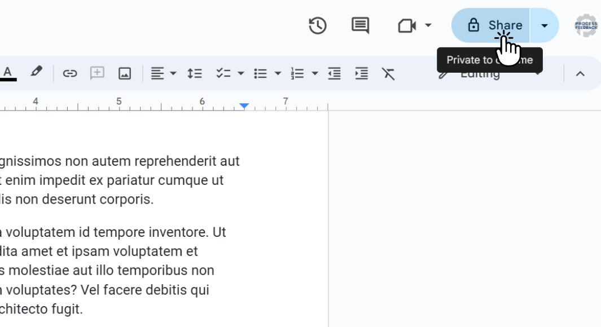
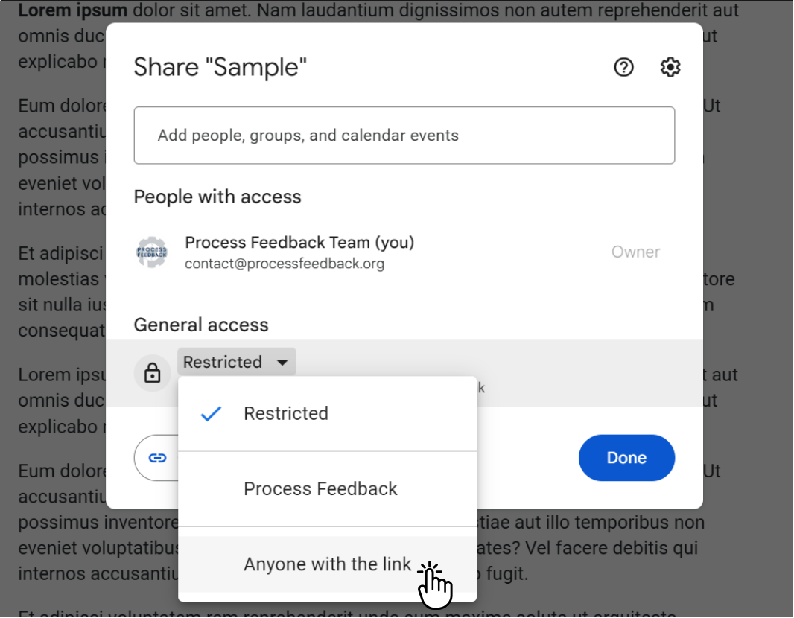
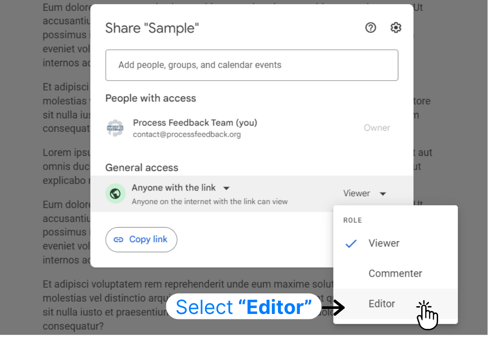
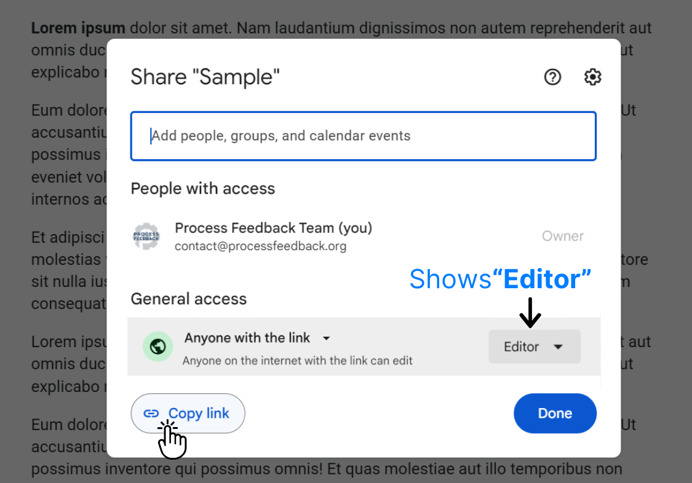

# How to obtain and share the "Edit Link" of a Google Docs document

---

One way to share your writing process with others, if you typed in Google Docs, is to obtain and share the Edit Link to your document. Having **edit access** to a Google Docs document also implies that the person has access to the entire edit history of your document. If you provide edit access to a Google Docs document to your teacher, you will have essentially shared your writing process.

The steps below show you how to obtain the "Edit Link" to your Google Docs document and share it with others.

### Step 1. Open the Google Docs document

---

Open the Google Docs document for which you would like to obtain an edit link.

### Step 2. Click on the "Share" button

---

Once your document is open, locate the “Share” button in the top right corner of the screen and click on it. This will open a sharing dialog box where you can specify who you want to share the document with and what level of access they should have.

  

### Step 3. Select "Anyone with the link" 

---

In the General access dropdown, change “Restricted” to “Anyone with the link.”

  

### Step 4. Change Viewer to "Editor"  

---

After selecting the “Anyone with the link” option, you have to further refine the level of access by changing the viewer permission to editor permission. Locate the dropdown menu next to the link-sharing options. By default, it may be set to “Viewer.” Click on the dropdown menu and select “Editor” to grant editing privileges to anyone with the link.

  

### Step 5: Click "Copy Link"

---

Click on the “Copy link” button to copy the shareable link. Paste this link wherever it is needed.

  

# Safer (alternative) approach

---

While the approach described above is easiest, if your document contains sensitive information, it is better to share the document only with the person you want to access it. For this, instead of choosing "Anyone with the link" you should choose the email address of the person you want to share the document with.
