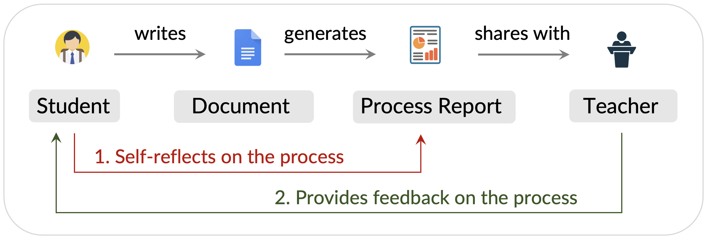

# Guides and Tutorials {#student-resources}
Resources for teachers, students, writing centers, teaching assistants, and more

## Student Resources
Guides for students to explore and reflect on their writing process or share their writing process report

### 1. Student submission guide [Read ↗](./student-submission-guide.md)   
Sharing writing process report with a teacher or peers

### 2. How to share the edit link of a Google Docs document [Read ↗](./how-to-provide-edit-access-in-gdocs.md)  
Instructions for obtaining and sharing edit link to a Google Docs document

### 3. How to reflect on your AI use [Read ↗](./how-to-reflect-on-ai-use.md)  
Reflection activities for assignments that involved generative AI

### 4. Why use Process Feedback [Read ↗](https://processfeedback.org/why-use-process-feedback/)  
Read how tools like Process Feedback make teaching and learning more effective  

### 5. 10-min course for students {#teacher-resources}
A mini-course for students new to the idea of process focus (Coming soon..)
<!-- [Open ↗](https://course.processfeedback.org)   -->

## Teacher Resources {#teacher-resources}
Guides for teachers to explore and discuss their students' working processes 

### 1. Identify AI-assisted writing patterns [Read ↗](./identify-ai-usage.md)    
Indicators based on copy-paste events, timing, and revision patterns

### 2. Prompts for discussing the writing process [Read ↗](writing-process-reflection-prompts.md)    
Guide for teachers to discuss a writing process report with students

### 3. Samples [Explore ↗](writing-process-reflection-prompts.md)    
Sample teacher dashboards, custom editors, writing reports, and more

### 4. I Have Many Students—How Can I Review Their Writing Processes?
Techniques to view many students' writing processes in a dashboard (Coming soon...)

---

## Using Process Feedback in a Course
Here are the choices for a teacher to integrate (or try) Process Feedback in a course

  

### Option 1: Students use Google Docs or Process Feedback's editor [Read ↗](./option-type-in-google-docs-or-pf.md)    

* Easiest option to pilot Process Feedback  
* Students don't need to install anything 

### Option 2: Create a special editor for your class [Read ↗](./option-create-custom-editor.md)  

* Recommended approach for most courses  
* Students see the course name in the editor

### Option 3: Create assignments in Process Feedback [Read ↗](./option-create-assignment.md) 

* Allows comparing students' writing processes       
* All student submissions appear up in a dashboard

### Option 4: Browser Extension for Canvas 
Coming soon..

<!-- → When to Use: Works with Canvas assignments and discussion boards         
→ Difficulty: Moderate  
→ Key Feature: Students can stay in Canvas; No data is collected    -->

<!-- 
## Options for Institutional Integration
Here are the choices for instutitions to integrate Process Feedback 

### LMS Integration for Canvas
Coming soon..
 -->
